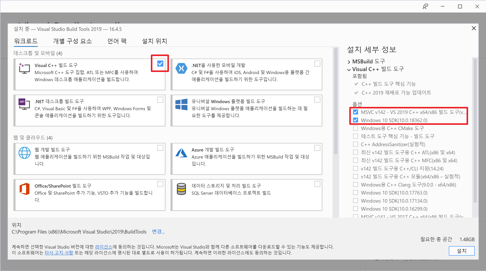
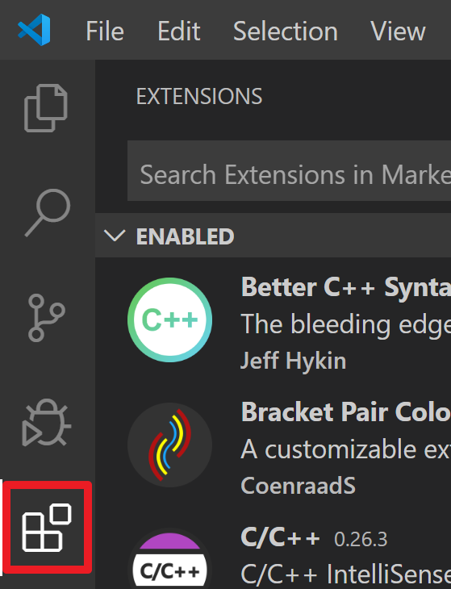
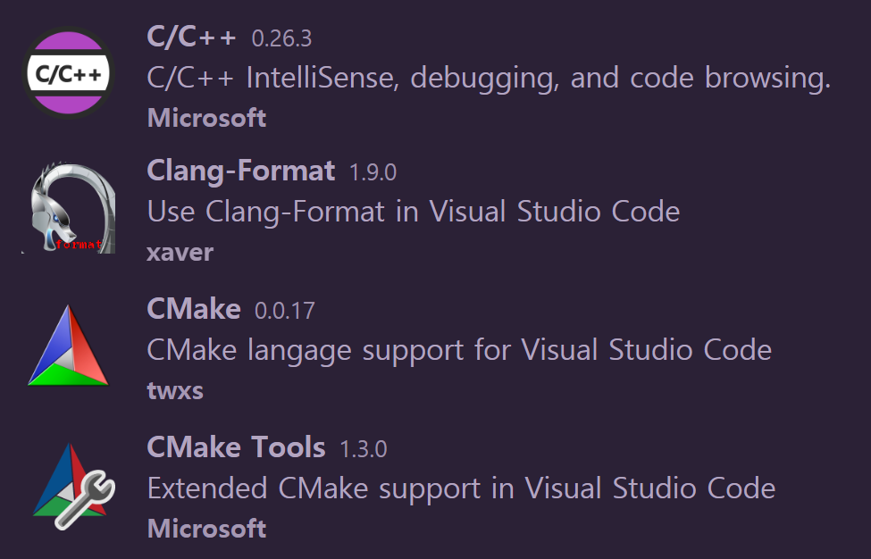

# Lightweight 한 개발환경 설정 #

## 설치할 것 ##
1. [Visual Studio 2019용 Build Tools](https://visualstudio.microsoft.com/thank-you-downloading-visual-studio/?sku=BuildTools&rel=16)  
아래의 빨간 네모박스에 해당하는 것만 설치  

2. [Visual Studio Code](https://code.visualstudio.com/download) (System Installer 64bit 다운로드 및 설치)  
Code 설치 이후 확장 프로그램 설치 (아래 왼쪽 그림의 빨간네모 선택)  
  
아래 그림에 수록된 확장프로그램 검색 후 설치  

## 그 외 다운로드만 할 것 ##
1. [CMake](https://github.com/Kitware/CMake)
2. [Ninja](https://github.com/Kitware/ninja)
3. [LLVM](http://releases.llvm.org)
4. [Git](https://github.com/git-for-windows/git)
5. [MinGW](https://github.com/brechtsanders/winlibs_mingw)
